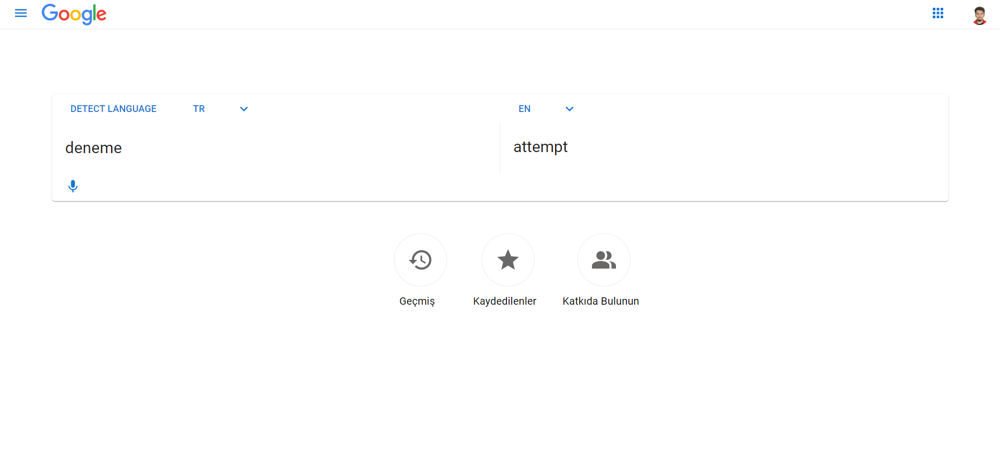
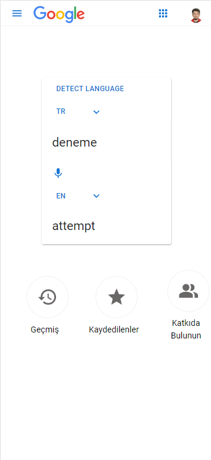
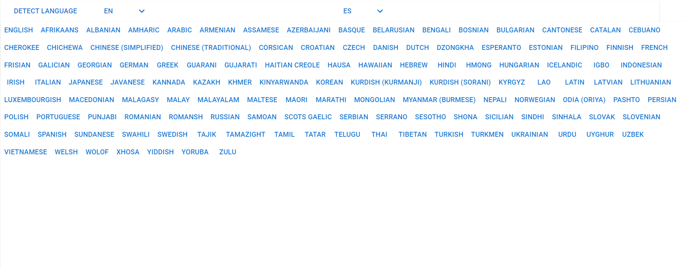

# Google Translate Clone
<h1>Explanation</h1>

I use React, Material UI and Axios for this project. This project created with "create-react-app" package. I choose as api to Google Translate Api from RapidAPI.
All components have responsive design.

<h1>Examples</h1>

